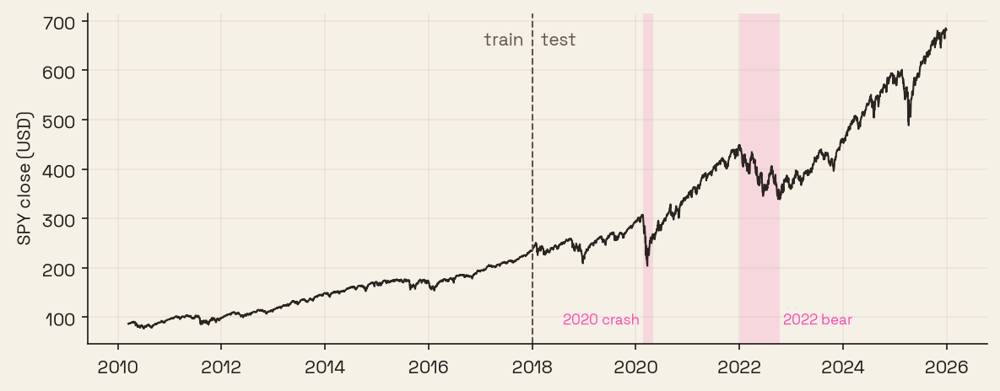
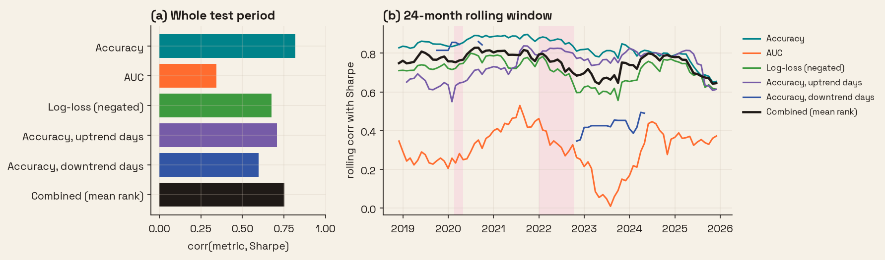
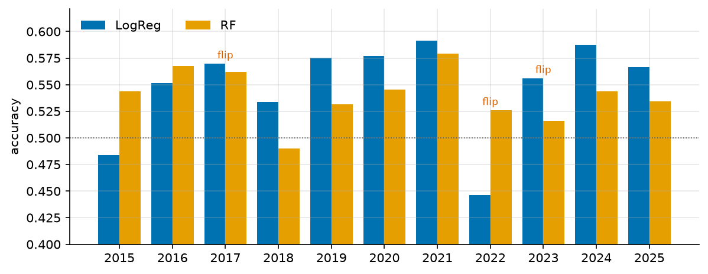
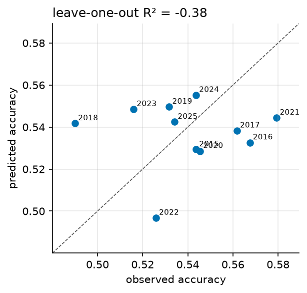

# evalsq

Code for the eval2 workshop talk (October 10, 2026). It runs three simple checks that ask whether a benchmark score still tracks the value it is meant to stand in for. The example predicts the next-day direction of SPY (2010 to 2025) with a logistic regression and a random forest, where the benchmark is a classification metric and the value is the Sharpe ratio of a long/short strategy that trades each prediction.

## Quick start

```bash
curl -LsSf https://astral.sh/uv/install.sh | sh   # if uv is not installed
git clone https://github.com/russro/evalsq && cd evalsq
uv sync
uv run evalsq      # downloads SPY on the first run, writes results/ and figures/
uv run pytest      # offline, uses synthetic data
```

`uv run evalsq --help` lists the options (`--cutoff` sets the train/test year, `--no-plots` skips the figures).

The default run takes about 15 seconds on 8 cores. `uv run evalsq --grid 25` adds the winner's-curse backup (25 GBM configs) and still finishes in under a minute. Months run in parallel; `--jobs 1` forces a serial run, and the code drops to serial on its own if the worker pool fails.

The monthly deployment only sees money that is already confirmed. Labels show up `--lag` trading days late (default 21), so both retraining and model selection at month start t use rows up to t−L.

## Figures

### Setup



SPY daily close. Models are trained on 2010 to 2017 and scored from 2018 onward. The shaded regions are the 2020 crash and the 2022 bear market, which are the two periods where the market regime changes the most within the test years.

### H1. Benchmark validity



Correlation between each candidate metric and the strategy's Sharpe ratio, computed per month. (a) Over the whole test period, accuracy has the highest correlation (0.82) and AUC the lowest (0.35). (b) The same correlation over a 24-month rolling window, averaged over the two models. Accuracy stays between 0.62 and 0.92 for both models, while AUC for the logistic regression drops to -0.55 in 2023, which means that months with a higher AUC tended to have a lower return during that window. Accuracy on downtrend days has gaps since many months have too few such days to score.

### H2. Temporal holdout



Accuracy of each model when trained on every year before the test year and scored on that year alone. The better model changes three times (2017, 2022 and 2023). The random forest only wins in 2015, 2016 and 2022. A single split at 2018 ranks the logistic regression first (0.56 against 0.52), which hides that the random forest is the better model during the 2022 bear market.

### H3. Predictability of the score



A linear model that predicts the random forest's yearly accuracy from the mean volatility and trend of that year, scored with leave-one-out. A high R² would mean that the benchmark mostly measures the market regime instead of the model. Here the R² is -0.38, so these two features do not predict the score, and the yearly accuracy still carries information about the model.

## Code

- `evalsq/data.py` downloads SPY and builds the features (returns, moving average ratios, volatility) and the next-day target.
- `evalsq/models.py` defines the two models. New models go in `make_models()`.
- `evalsq/heuristics.py` implements H1, H2 and H3.
- `evalsq/plots.py` draws the figures above.
- `evalsq/cli.py` is the entry point.
