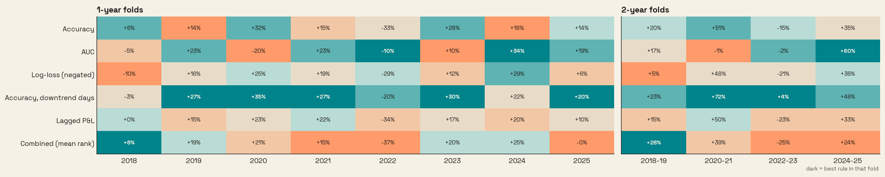
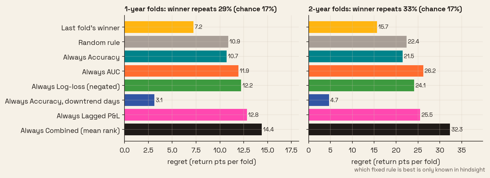
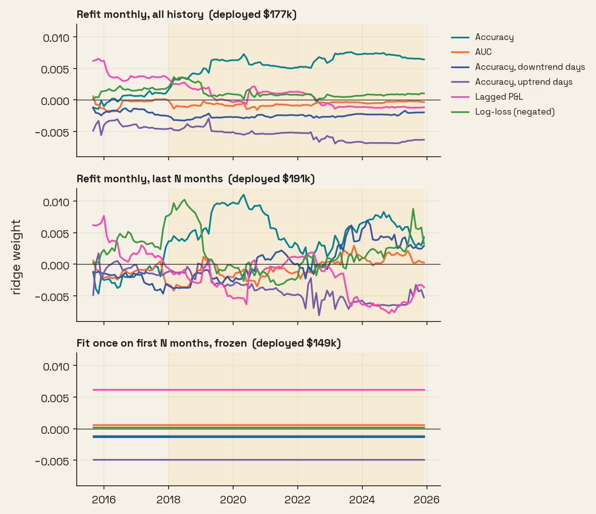
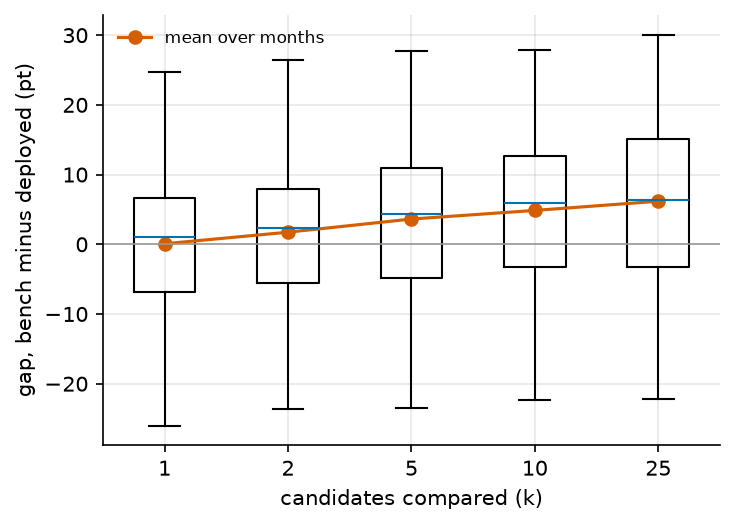
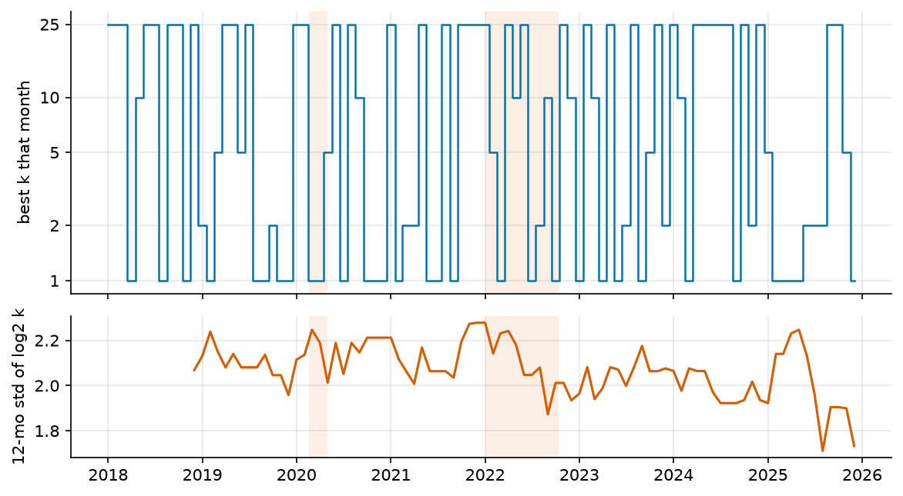

# evalsq

Code for the eval2 workshop talk (October 10, 2026). It runs three simple checks that ask whether a benchmark score still tracks the value it is meant to stand in for. The example predicts the next-day direction of SPY (2010 to 2025) with a logistic regression and a random forest, where the benchmark is a classification metric and the value is the Sharpe ratio of a long/short strategy that trades each prediction.

## Quick start

```bash
curl -LsSf https://astral.sh/uv/install.sh | sh   # if uv is not installed
git clone https://github.com/russro/evalsq && cd evalsq
uv sync
uv run evalsq      # downloads SPY on the first run, writes results/ and figures/
uv run pytest      # offline, uses synthetic data
```

`uv run evalsq --help` lists the options (`--cutoff` sets the train/test year, `--no-plots` skips the figures).

The default run takes about 15 seconds on 8 cores. `uv run evalsq --grid 25` adds the winner's-curse backup (25 GBM configs) and still finishes in under a minute. Months run in parallel; `--jobs 1` forces a serial run, and the code drops to serial on its own if the worker pool fails.

The monthly deployment only sees money that is already confirmed. Labels show up `--lag` trading days late (default 21), so both retraining and model selection at month start t use rows up to t−L.

Deployment $ are net of costs: `--cost-bp` per unit of position traded (default 1bp; a long/short flip is 2 units, including flips at model swaps and the first entry from cash) and `--borrow` per year while short (default 0.5%). `deploy_summary.csv` keeps the gross $ next to net, and `deploy_cost_sweep.csv` shows final $ at 0/1/2/5/10bp.

## Figures

### Setup


SPY daily close. Models are trained on 2010 to 2017 and scored from 2018 onward. The shaded regions are the 2020 crash and the 2022 bear market, which are the two periods where the market regime changes the most within the test years.

### H1. Benchmark validity


Correlation between each candidate metric and the strategy's Sharpe ratio, computed per month. (a) Over the whole test period, accuracy has the highest correlation (0.82) and AUC the lowest (0.35). (b) The same correlation over a 24-month rolling window, averaged over the two models. Accuracy stays between 0.62 and 0.92 for both models, while AUC for the logistic regression drops to -0.55 in 2023, which means that months with a higher AUC tended to have a lower return during that window. Accuracy on downtrend days has gaps because it needs at least 3 days below the 50-day average in a month, and only 44 of the 96 test months have that, mostly outside the 2018 to 2022 bull run. The combined score (mean percentile rank over the five metrics) correlates at 0.75 overall, below accuracy alone.

### H2. Selector stability



Does the best eval stay the best? The monthly net returns of each selection rule (from the H1b walk-forward) are compounded within blocked time folds of one and two calendar years, and the rules are ranked within each fold. Accuracy on downtrend days is best in 5 of 8 years and 2 of 4 two-year blocks, but the previous fold's best rule is best again in only 2 of 7 one-year transitions (29%, chance 17%) and 1 of 3 two-year transitions.



Regret is the return lost per fold against the best rule in hindsight, averaged over folds 2 onward. Following the previous fold's winner costs 7.2 points a year, less than a random rule (10.9) but more than always using accuracy on downtrend days (3.1), though choosing that fixed rule is itself a hindsight decision. With 4 to 8 folds this is a stability check, not a significance test.

### H3. Predictability of the score


A linear model that predicts the random forest's accuracy from the mean volatility and trend of the period, scored with leave-one-out. (a) per year, (b) per month; color goes from early (teal) to late (pink). A high R² would mean that the benchmark mostly measures the market regime instead of the model. Here the R² is -0.38 per year and -0.03 per month, so these two features do not predict the score, and the yearly accuracy still carries information about the model.

### Deployment and the Bogleheads line

`fig5_deploy.png` shows portfolio value under each selection rule, including `combined` (the model with the best mean rank over the other five rules that month). `fig5b_deploy_bogle.png` adds a Bogleheads three-fund portfolio (60% VTI, 20% VXUS, 20% BND, rebalanced monthly; `--no-bogle` skips it). The combined rule ends at $177k, below accuracy alone ($222k). The three-fund portfolio ends at $215k, under always-long SPY ($287k) because of the bond and international share.

### Learned benchmark



Instead of picking a metric by hand, a ridge regression learns which bench signals predict a model's next-month return (`evalsq/learned.py`). Inputs are the six signals, demeaned across the zoo each month; the target is the model's return minus the zoo average, so the month effect drops out. No model identity goes in. It trains on walk-forward months from 2012-08 (`--meta-start`, these months do not change any other result) and deploys from 2018, with a two-month gap so it only sees returns that are already visible. Three modes: refit monthly on all history, refit monthly on the last 36 months, or fit once on the first 36 months and freeze.

Net of costs it ends at $177k (all history), $191k (rolling) and $149k (frozen), all below accuracy alone ($209k), bear-day accuracy ($320k) and never switching ($344k). Its monthly rank correlation with realised returns is about zero (leave-one-model-out 0.04, t = 0.9). The all-history fit settles on accuracy minus uptrend accuracy, close to bear-day accuracy. The frozen fit leans on lagged P&L, a weight the rolling fit turns negative after 2023, so drift breaks the static version.

### Backup: winner's curse spread and best pool size



Monthly gap between the winner's bench accuracy and its deployed accuracy, per pool size k. The mean climbs from 0.1pt (k=1) to 6.2pt (k=25), but single months range from about -25pt to +30pt at every k.



The pool size whose winner deployed best, month by month, with its 12-month mean, and the 12-month rolling std of k. The best k is 1 in 32 months and 25 in 39, and it flips between the two with no link to the crash or the bear market. Deployed accuracy barely moves with k (54.0% to 54.4%), so a bigger search only inflates the bench number.

## Code

- `evalsq/data.py` downloads SPY and builds the features (returns, moving average ratios, volatility) and the next-day target.
- `evalsq/models.py` defines the two models. New models go in `make_models()`.
- `evalsq/heuristics.py` implements H1 and H3; `evalsq/deploy.py` implements the monthly walk-forward and H2 (`h2_selectors`).
- `evalsq/deploy.py` runs the monthly walk-forward, the selection rules and the winner's curse (`winners_curse_monthly`, `optimal_k`).
- `evalsq/learned.py` is the learned benchmark: ridge meta-model, retraining modes, leave-one-model-out check.
- `evalsq/plots.py` draws the figures above.
- `evalsq/cli.py` is the entry point.
- `slides/outline.md` is the first-pass slide outline. `slides/mockups.py` draws the diagram mockups (`slides/mock_*.png`) to redraw in draw.io.
